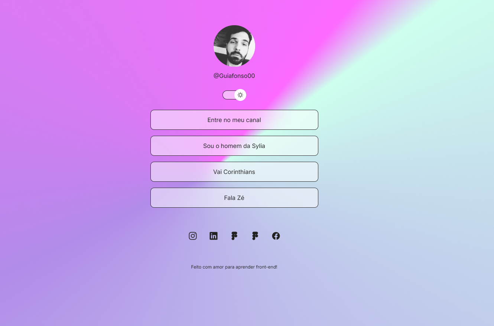

    
 

<h1 align="center">
Projeto número 1 do curso Rockseat &#128512;
</h1>

 Projeto baseado em aulas práticas onde foi desenvolvido um formulário usando CSS + Html e Javascript básicos. 

 Licença MIT. &#128512; &#128512; 

